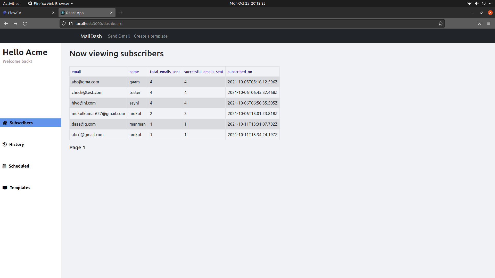
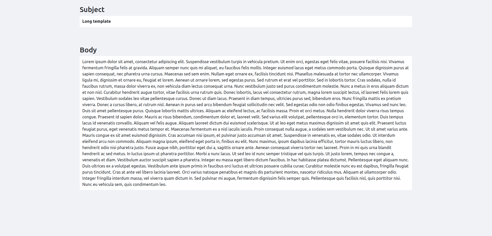

# Email-Service ( yet to come up with a better name )
Short summary: Mailchimp like stripped down barebones system with core functionality. Allows people to subscribe to platform users.
Users can then send newsletters at will or schedule them. They can create their own templates or choose from a set. 

## Dashboard for users to stay on top of things

## Save / create a template for later use 

